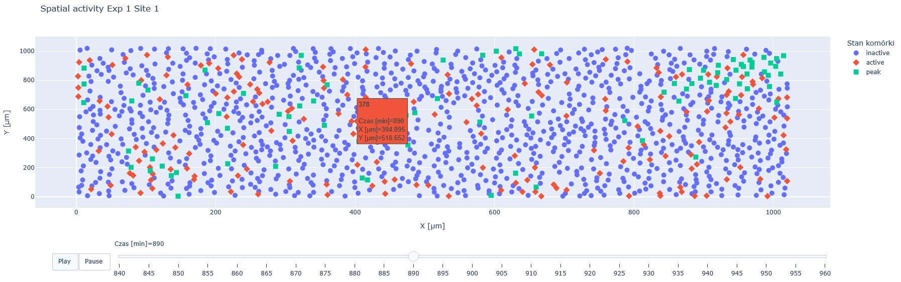

# Spatiotemporal-Signaling
Spatiotemporal data analysis activity of two important signalling pathways: ERK and AKT. All the necessary data is in the **data** folder, which also contains a picture of the sample analyses. Detailed information on the origin of the data analysed and a comprehensive description of the task can be found [here](https://github.com/kugi8412/Spatiotemporal-Signaling/blob/main/Spatiotemporal_description.pdf).

## 🔬 Sygnalomics_1.ipynb
🎯 Goals:
* Compute and visualize average ERK and AKT activity over time by mutation, with uncertainty intervals,
* Statistical testing: wild type vs. each mutant using Mann–Whitney Test (pairwise) and Kruskal–Wallis (global).

⚙️ Workflow:
* Define cell states (inactive / active / peak) via per-cell Z-score thresholds,
* Plotly visualizations using `plotly`,
* Checking how the state of the cells changes over time.

## 🔬 Sygnalomics_2.ipynb
🎯 Goals:
* Neighbor analysis: count total vs. active neighbors with KDTree,
* Signal propagation: conditional P(cell active at t | neighbor state at t+Δ),
* Movement propagation: change in distance to the nearest peak neighbor over time,
* Mutation comparison: evaluate how mutations modify local signaling and movement.

## 🔬 Further research
The _Sygnalomics_2.ipynb_ file shows that there is a mutation where cell movement is correlated with ERK signalling levels. The analysis was done at a global level, but there is a significant change for the PIK3CA_H1047R mutation. In addition, it was shown that the change in signal levels occurs locally and that there is signal propagation. The analyses performed allow a valid local analysis, such as:
* Detecting the propagation of activation in space (e.g. by analysing the speed of 'waves' of activity between neighbouring cells),
* Classifying temporal trajectories into types (e.g. impulsive, sustained, silent) and compare their frequency of occurrence between mutants.

